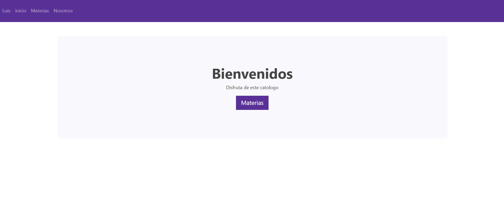
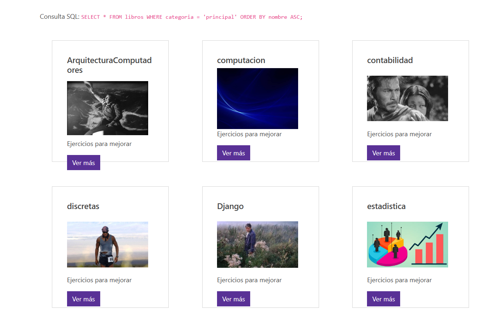
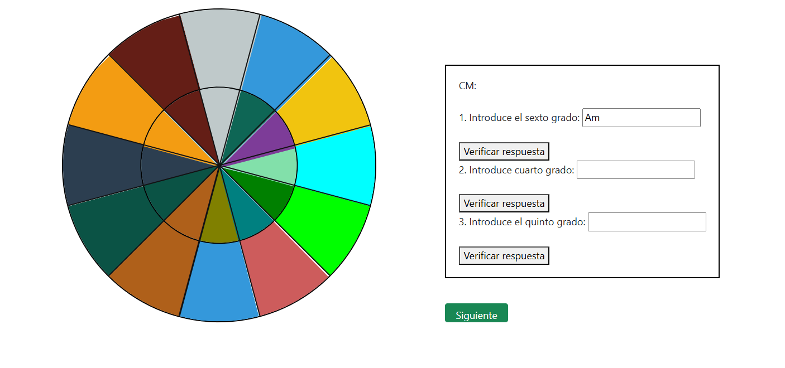
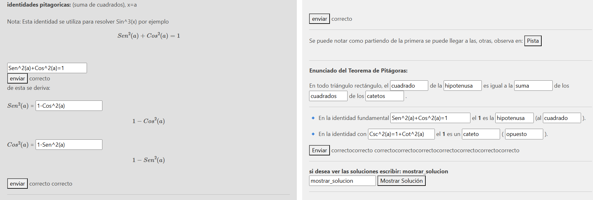

Recomendacion, descargar en C:/ , yo lo hice ahi (no confundirse en las instrucciones, son rutas mias).

Instrucciones rapidas (es parecido a pythonWeb, se pueden incluso guiar por los mensajes ded error en la pagina): Descargar Xampp, inicializar Apache y MySQL (start) (esto se hace en el controlPanel), luego dirigirse a phpMyAdmin, esto se puede hacer directamente desde el navegador http://localhost/phpmyadmin/ o ya que estan en el controlPanel entonces click en admin.

Una vez ya esten en http://localhost/phpmyadmin/ crear una base de datos (Nueva, en tablero lateral), yo la llame sitio, luego crear la tabla (4 columnas), yo la llame libros (primero tratar de comprender un poco del codigo, porque esta info esta en : C:\xampp\htdocs\php_web\productos.php), entonces, si quieren llamar la tabla diferente, entonces cambian: $sentenciaSQL= $conexion->prepare("SELECT * FROM libros"); Esta es la estructura de la tabla (enfasis en que deben seleccionar AUTO_INCREMENT para id )

1 id Primaria int(11) AUTO_INCREMENT ......

luego, para cargar las paginas que yo hice, deben comenzar a llenar la base de datos con los nombres en: C:\xampp\htdocs\php_web\productos.php), esto se hace en http://127.0.0.1/php_web/administrador/seccion/productos.php, pero para ingresar el usiario y contraseña, mirenlo primero en C:\xampp\htdocs\php_web\administrador\index.php.

Esto es una guia rapida, no se guardo la que tenia, ademas, si se comprende el codigo y guiandose de los mensajes, no es dificil cargar todo..

--------
https://phpweb-production.up.railway.app/productos.php

el transpaso de los datos se hizo con DBeaver. el railway vale 5$ despues de un mes o algo asi, entonces dejara de funcionar.

